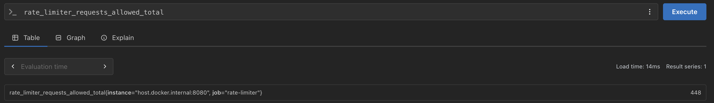
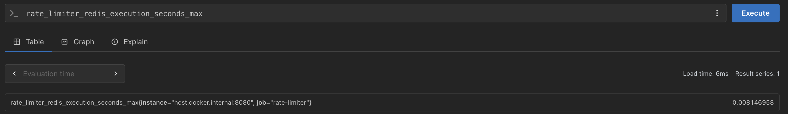
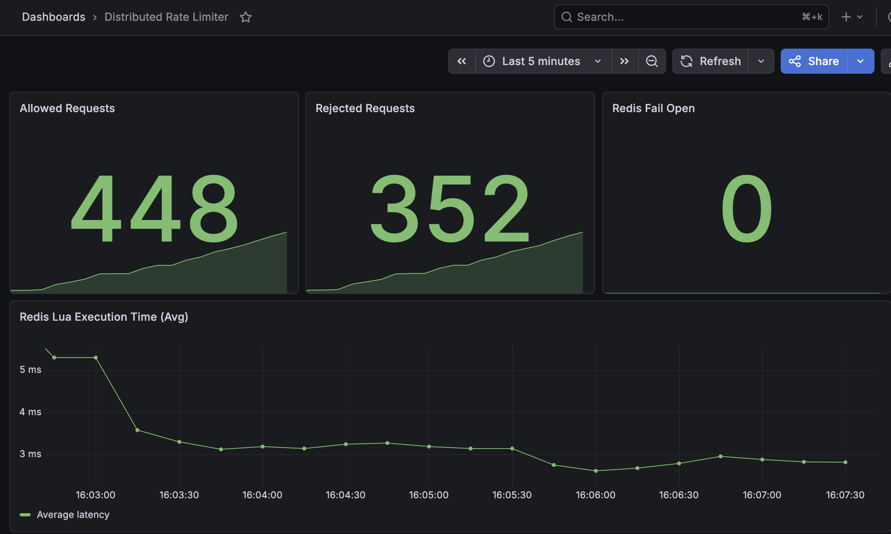

# Distributed Rate Limiter

A distributed rate limiter built with Java 21, Spring Boot WebFlux, Redis, and Lua scripting.

The project demonstrates how to enforce request quotas consistently across multiple application instances by externalizing rate-limit state to Redis and executing rate-limit decisions atomically using Redis Lua scripts.

Currently implemented algorithms:

- Token Bucket
- Sliding Window (Redis Sorted Sets)

---

## Motivation

A rate limiter implemented with in-memory data structures works only for a single application instance.

```text
           Load Balancer
          /             \
     Instance A      Instance B
     tokens = 3      tokens = 3
```

A client can bypass the intended limit simply because requests are distributed across different JVMs.

This project externalizes the rate-limit state into Redis so every application instance shares the same source of truth.

```text
          Load Balancer
          /            \
     Instance A    Instance B
            \        /
             \      /
              Redis
```

Regardless of which instance receives the request, the same Redis state is updated atomically.

---

## Features

- Spring WebFlux `WebFilter` for global request interception
- Reactive Redis integration using `ReactiveRedisTemplate`
- Redis Lua scripting for atomic rate-limit decisions
- Configurable algorithm selection
    - Token Bucket
    - Sliding Window
- HTTP `429 Too Many Requests`
- `X-RateLimit-Remaining` response header
- Fail-open strategy when Redis is unavailable
- Integration tests using Testcontainers

---

## Tech Stack

- Java 21
- Spring Boot 3.5.x
- Spring WebFlux
- Reactor
- Spring Data Redis Reactive
- Redis
- Lua
- Gradle
- Testcontainers
- JUnit 5

---

## Architecture

```text
HTTP Request
      │
      ▼
RateLimiterFilter
      │
Extract Client Identifier
(X-API-KEY or Remote IP)
      │
      ▼
RateLimiterService
      │
      ▼
ReactiveRedisTemplate
      │
      ▼
Redis Lua Script
(Token Bucket / Sliding Window)
      │
      ▼
Decision:
Allow or Reject
      │
      ├──► Continue request
      └──► HTTP 429
```

---

## Algorithms

### Token Bucket

Each client owns a bucket with a maximum capacity.

Tokens are replenished continuously based on the configured refill rate.

Advantages:

- Smooth average request rate
- Efficient memory usage
- Simple implementation

Trade-off:

After a long idle period, a client can accumulate tokens and send a burst of requests.

---

### Sliding Window

Each request timestamp is stored inside a Redis Sorted Set.

For every incoming request:

1. Remove expired timestamps.
2. Count requests still inside the window.
3. Reject if capacity has been reached.
4. Otherwise add the new timestamp.

Advantages:

- Fairer request distribution
- Eliminates burst accumulation

Trade-offs:

- Higher Redis memory usage
- Additional Sorted Set operations

---

## Why Lua?

Each rate-limit decision requires multiple Redis operations:

- Read state
- Compute new state
- Update Redis
- Return result

Without Lua, concurrent application instances could interleave these operations and violate the rate limit.

Redis executes each Lua script atomically, ensuring the entire decision behaves as a single operation.

---

## Failure Strategy

If Redis becomes unavailable, the application intentionally fails open.

Instead of rejecting all traffic, requests continue while the limiter reports a sentinel value for the remaining quota.

This prioritizes service availability over strict rate-limit enforcement during transient Redis outages.

---

## Configuration

```yaml
rate-limiter:
  algorithm: TOKEN_BUCKET
  capacity: 3
  refill-rate: 0.0005
  window-length: 10000
```

Changing the algorithm requires only a configuration update.

---

## Running

Start Redis

```bash
docker run --name redis-rate-limiter -p 6379:6379 redis:latest
```

Run the application

```bash
./gradlew bootRun
```

---

## Manual Verification

Example:

```bash
curl -i \
-H "X-API-KEY: user1" \
http://localhost:8080/api/v1/health
```

Expected:

```text
200
200
200
429
```

with

```text
X-RateLimit-Remaining

2
1
0
0
```

After the configured window (Sliding Window) or sufficient refill time (Token Bucket), requests are accepted again.

---
## Monitoring

The application is instrumented using Micrometer for metrics collection.

Spring Boot Actuator exposes metrics through `/actuator/prometheus`.

Prometheus periodically scrapes the metrics endpoint and stores time-series data.

Grafana visualizes the collected metrics using Prometheus as the data source.

### Exposed Metrics

- `rate_limiter_requests_allowed_total`
- `rate_limiter_requests_rejected_total`
- `rate_limiter_redis_fail_open_total`
- `rate_limiter_redis_execution_seconds`

### Verification

**Prometheus Target**

Verified that Prometheus successfully scrapes the application.


**Prometheus Query**

Verified custom Micrometer metrics are available in Prometheus.





**Grafana Dashboard**

Dashboard visualizing:

- Allowed Requests
- Rejected Requests
- Redis Fail Open
- Redis Lua Execution Latency



## Future Improvements

- Use Redis `TIME` to eliminate application clock skew.
- Generate collision-free Sorted Set members.
- Return `Retry-After` response headers.
- Add Micrometer and Prometheus metrics.
- Docker Compose for local development.
- GitHub Actions CI pipeline.